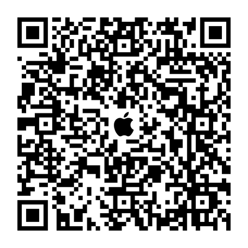

# Python App Development Tools

This project provides a set of tools useful for app development written in Python. It currently includes two tools:

1. QR Code Generator for App Store Links
2. PNG to Base64 Converter for HTML img Tags

## QR Code Generator

The QR Code Generator creates QR codes that link to apps on the Apple App Store and Google Play Store. It includes embedded Apple and Google logos in the center of the QR codes.

### Usage

```python
# /usr/local/bin/python3.11 qr_code.py
if __name__ == '__main__':
    # Define the input string and the file names
    app_name = "voice_bridge"
    input_string_apple = "https://apps.apple.com/us/app/speech-translator-be-heard/id6479205508"
    input_string_google = "https://play.google.com/store/apps/details?id=com.answersolutions.talkwise.voicebridge"
    output_filename_apple = "apple_" + app_name + "_qr_code.png"
    output_filename_google = "google_" + app_name + "_qr_code.png"
    logo_path_apple = "stores_apple.png"
    logo_path_google = "stores_play.png"

    generate_qr_code_with_image(input_string_apple, output_filename_apple, logo_path_apple)
    generate_qr_code_with_image(input_string_google, output_filename_google, logo_path_google)
```

### Result

<table>
  <tr>
    <td>Apple Store Link</td>
     <td>Google Play Link</td>
  </tr>
  <tr>
    <td></td>
    <td></td>
  </tr>
 </table>

## PNG to Base64 Converter

The PNG to Base64 Converter tool converts PNG image files to base64-encoded strings for use in HTML  tags. It can be useful when developing Chrome or Safari extensions or in other cases where you cannot deploy PNG images with your code.

### Usage

```python
# /usr/local/bin/python3.11 base64Image.py
if __name__ == '__main__':
    img_string = image_to_base64_html_string("undo_white.png")
    html_tag = f''
    print(html_tag)
```

## Dependencies

- Python 3.11
- `from io import BytesIO`
- `base64`
- `PIL` (Python Imaging Library)

### Installation

You can install the required dependencies using pip. Run the following command in your terminal:

```bash
pip install pillow
```

### Contact

Connect and follow me on LinkedIn: [Sergey N](https://www.linkedin.com/in/sergey-neskoromny/)

### MIT License

Copyright (c) 2024 Sergey Nes

Permission is hereby granted, free of charge, to any person obtaining a copy
of this software and associated documentation files (the "Software"), to deal
in the Software without restriction, including without limitation the rights
to use, copy, modify, merge, publish, distribute, sublicense, and/or sell
copies of the Software, and to permit persons to whom the Software is
furnished to do so, subject to the following conditions:

The above copyright notice and this permission notice shall be included in all
copies or substantial portions of the Software.

THE SOFTWARE IS PROVIDED "AS IS", WITHOUT WARRANTY OF ANY KIND, EXPRESS OR
IMPLIED, INCLUDING BUT NOT LIMITED TO THE WARRANTIES OF MERCHANTABILITY,
FITNESS FOR A PARTICULAR PURPOSE AND NONINFRINGEMENT. IN NO EVENT SHALL THE
AUTHORS OR COPYRIGHT HOLDERS BE LIABLE FOR ANY CLAIM, DAMAGES OR OTHER
LIABILITY, WHETHER IN AN ACTION OF CONTRACT, TORT OR OTHERWISE, ARISING FROM,
OUT OF OR IN CONNECTION WITH THE SOFTWARE OR THE USE OR OTHER DEALINGS IN THE
SOFTWARE.